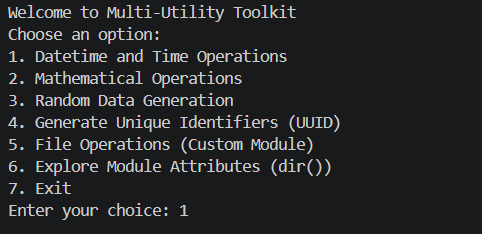
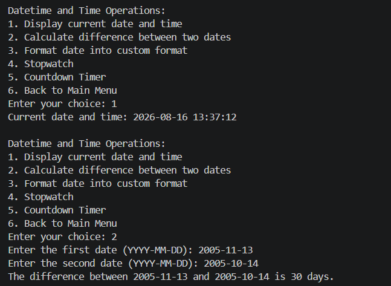
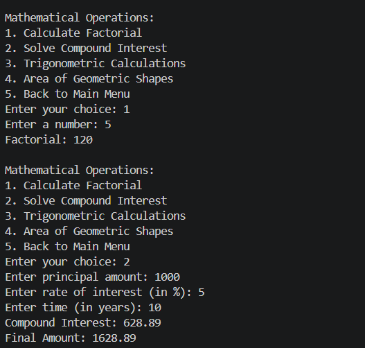
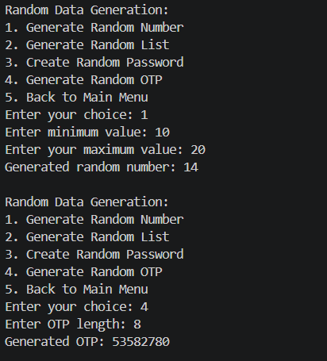
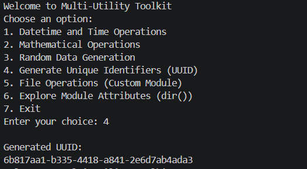
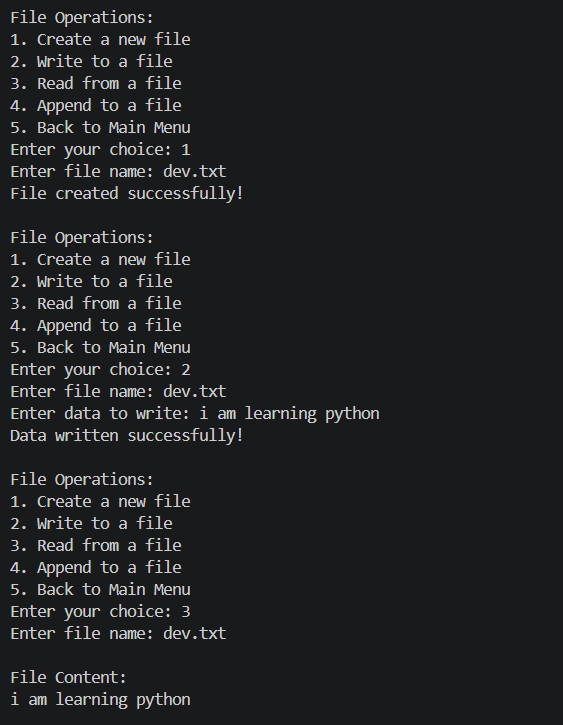
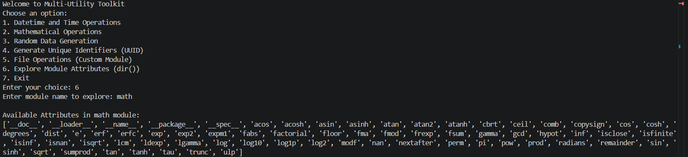

# 🧰 Multi-Utility Toolkit

A **menu-driven, all-in-one command-line application** built in Python that brings together date/time tools, math utilities, random data generation, file handling, and Python introspection — all from a single, easy-to-navigate interface.

---

## 📖 Overview

The **Multi-Utility Toolkit** is a modular CLI application designed to demonstrate clean program structure, practical use of Python's standard library, and thoughtful UX for terminal-based tools. It was built to showcase problem-solving, modular design, and real-world scripting skills — from working with `datetime` and `math`, to file I/O, random data generation, and dynamic module exploration with `dir()`.

> 💡 **Why this project?** It's a compact showcase of core Python fundamentals applied to genuinely useful, everyday utilities — the kind of small tools developers reach for constantly.

---

## ✨ Features

| Module | Description |
|--------|-------------|
| 🕒 **Datetime & Time Operations** | Display current date/time, calculate date differences, format dates, run a stopwatch, and set a countdown timer |
| ➗ **Mathematical Operations** | Factorial calculation, compound interest solver, trigonometric calculations, and geometric area calculations |
| 🎲 **Random Data Generation** | Generate random numbers, random lists, secure passwords, and one-time passwords (OTPs) |
| 🆔 **UUID Generator** | Instantly generate unique identifiers (UUIDs) for use in apps, databases, or testing |
| 📁 **File Operations** | Create, write, read, and append to files through a simple custom file-handling module |
| 🔍 **Module Explorer** | Dynamically inspect any Python module's attributes and functions using `dir()` |

---

## 🗺️ Application Flow

```mermaid
flowchart TD
    A([🚀 Start Program]) --> B{{Main Menu}}
    B -->|1| C[🕒 Datetime & Time Operations]
    B -->|2| D[➗ Mathematical Operations]
    B -->|3| E[🎲 Random Data Generation]
    B -->|4| F[🆔 Generate UUID]
    B -->|5| G[📁 File Operations]
    B -->|6| H[🔍 Explore Module Attributes]
    B -->|7| I([🛑 Exit])

    C --> C1[Display Current Date & Time]
    C --> C2[Calculate Difference Between Dates]
    C --> C3[Format Date - Custom Format]
    C --> C4[Stopwatch]
    C --> C5[Countdown Timer]

    D --> D1[Calculate Factorial]
    D --> D2[Solve Compound Interest]
    D --> D3[Trigonometric Calculations]
    D --> D4[Area of Geometric Shapes]

    E --> E1[Generate Random Number]
    E --> E2[Generate Random List]
    E --> E3[Create Random Password]
    E --> E4[Generate Random OTP]

    G --> G1[Create a File]
    G --> G2[Write to a File]
    G --> G3[Read from a File]
    G --> G4[Append to a File]

    C1 & C2 & C3 & C4 & C5 --> B
    D1 & D2 & D3 & D4 --> B
    E1 & E2 & E3 & E4 --> B
    F --> B
    G1 & G2 & G3 & G4 --> B
    H --> B
```



---

## 🖥️ Demo Screenshots

### 🏠 Main Menu
The central hub connecting every module in the toolkit.



---

### 🕒 Datetime & Time Operations
Displaying the current date/time and calculating the difference between two dates.



---

### ➗ Mathematical Operations
Calculating factorials and solving compound interest problems.



---

### 🎲 Random Data Generation
Generating random numbers within a range and creating secure OTPs.



---

### 🆔 UUID Generator
Generating a unique identifier (UUID) in a single command.



---

### 📁 File Operations
Creating, writing, and reading files through the custom file-handling module.



---

### 🔍 Module Explorer
Using `dir()` to dynamically inspect the attributes of Python's built-in `math` module.



---

## 🛠️ Tech Stack

- **Language:** Python 3
- **Core Libraries:** `datetime`, `math`, `random`, `uuid`, `time`, `os`
- **Design:** Modular, menu-driven CLI architecture with custom file-handling module

---

## 🚀 Getting Started

### Prerequisites
- Python 3.8 or higher installed on your machine

### Installation & Run

```bash
# Clone the repository
git clone https://github.com/<your-username>/multi-utility-toolkit.git

# Navigate into the project folder
cd multi-utility-toolkit

# Run the application
python main.py
```

Then simply follow the on-screen menu prompts to explore each module. 🎉

---

## 📂 Project Structure

```
multi-utility-toolkit/
│
├── main.py                # Entry point - main menu logic
├── datetime_operations.py # Date/time utilities
├── math_operations.py     # Mathematical utilities
├── random_operations.py   # Random data generation
├── file_operations.py     # Custom file-handling module
├── screenshots/           # Demo screenshots used in this README
└── README.md               # Project documentation
```

## 📄 License

This project is licensed under the [MIT License](LICENSE) — feel free to use, modify, and share.

---

<p align="center">⭐ If you found this project useful, consider giving it a star on GitHub! ⭐</p>
